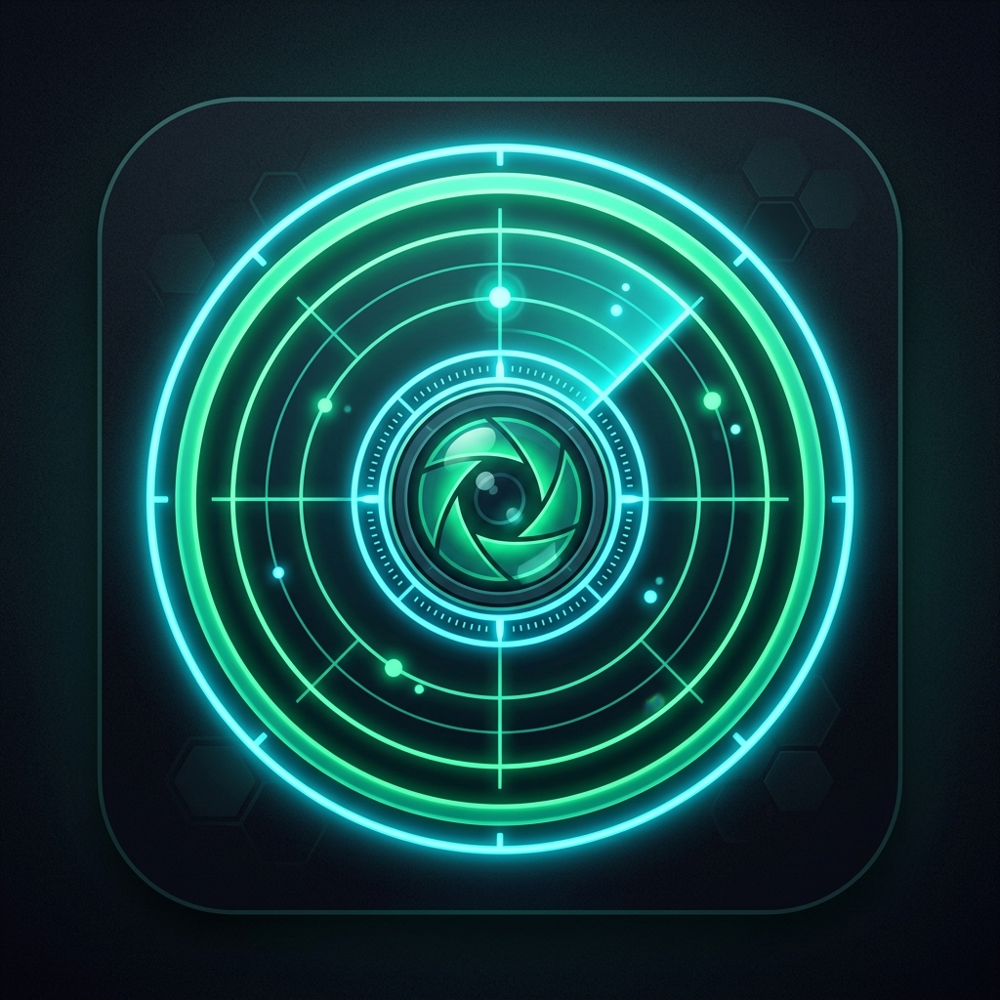

<div align="center">
  
  <h1>WHEL Recorder</h1>
  <p><strong>A Premium, Modern Gaming Screen Recorder & Replay Buffer</strong></p>
</div>

---

**WHEL Recorder** is an incredibly sleek, high-performance screen recording application built with Electron. Designed for gamers and creators, it features an OBS-style Replay Buffer, process-specific audio loopback (record your game without recording Discord!), and a stunning built-in gallery to review and trim your clips.

## ✨ Features

- 🎥 **High-Performance Screen Capture:** Record your entire desktop or specific windows with extremely low overhead.
- ⏪ **Replay Buffer (Always Recording):** Never miss a moment. Hit a global hotkey to instantly save the last X seconds of gameplay.
- 🎙️ **Studio-Grade Microphone Processing:** Raw Float32 hardware capture with UI-configurable Noise Suppression, Echo Cancellation, Auto Gain Control, and a custom Noise Gate to keep your mic completely silent when not talking!
- 🎛️ **Process-Specific Audio Loopback:** Select a specific game or application and record *only* its audio. Perfect for listening to Spotify or talking on Discord without ruining your clip's audio!
- ⌨️ **Global Hotkeys:** Fully customizable hotkeys for Recording, Replay Buffer, Bookmarks, and Muting.
- 🎞️ **Beautiful Built-in Gallery:** A premium, dark-mode gallery to view your saved recordings.
- ✂️ **In-App Trimming & Bookmarking:** Drop markers on the timeline while playing, and perfectly trim your clips right inside the app using the custom-built video player.

## 🚀 Installation

### Using the Installer (Recommended)
1. Download the latest `WHEL Recorder Setup.exe` from the [Releases](https://github.com/Mahee000/WHEL-Recorder/releases) page.
2. Run the installer.
3. Open the app and start recording!

### Build from Source
If you prefer to build the app yourself:

```bash
# Clone the repository
git clone https://github.com/Mahee000/WHEL-Recorder.git

# Navigate to the project directory
cd WHEL-Recorder

# Install dependencies
npm install

# Run the app in development mode
npm start

# Build the production executable
npm run dist
```

## 🛠️ Technology Stack
- **Electron** - Core framework
- **HTML/CSS/JS** - Custom premium UI with Vanilla flexbox layouts
- **Chromium MediaRecorder** - Native video encoding (WebM/MKV)
- **application-loopback** - C++ native audio hook for process-specific isolation

## 🎮 How to Use

1. **Add a Source:** Click "Add Source" and select your Desktop or Game window.
2. **Audio Setup:** Your Microphone and Desktop audio are automatically added. You can use the "Add App Audio" button to capture audio from a specific game.
3. **Record:** Click the big "Start Recording" button or use your `F9` hotkey.
4. **Replay Buffer:** Enable the Replay Buffer, play your game, and hit `F8` to save the last configured seconds of gameplay instantly!
5. **Gallery:** Switch to the Gallery tab to review, trim, and delete your clips.

## 🤝 Contributing
Contributions, issues, and feature requests are welcome! Feel free to check the [issues page](https://github.com/Mahee000/WHEL-Recorder/issues).

## 📝 License
This project is released under the [MIT License](LICENSE).
